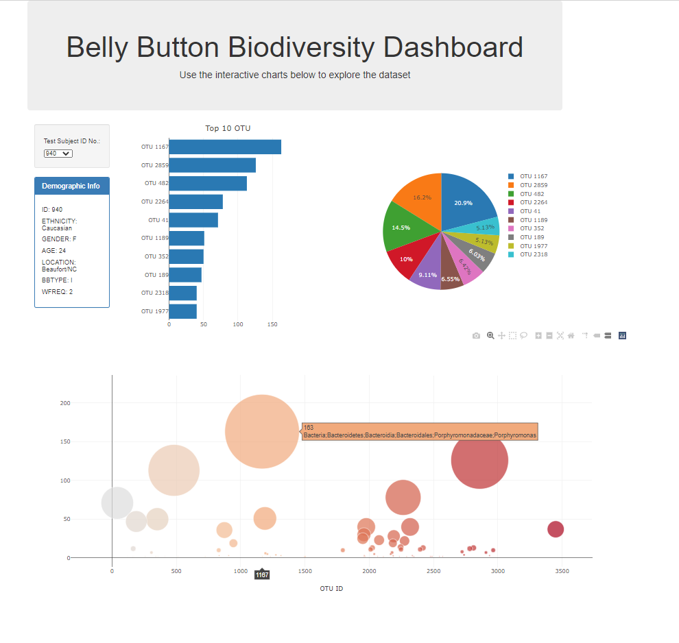
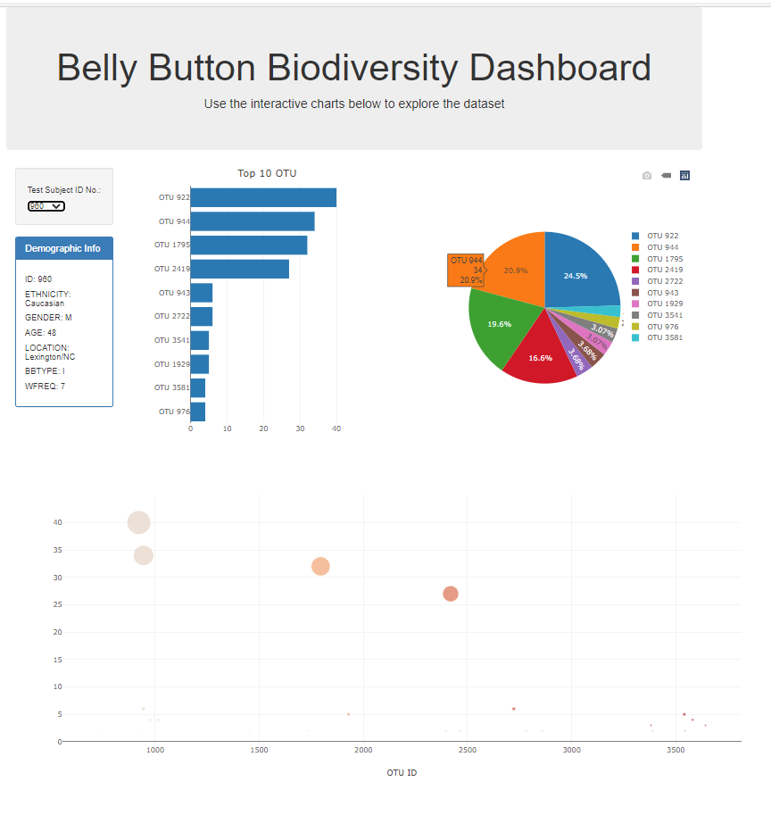

# Plot.ly Homework - Belly Button Biodiversity

For this Bootcamp project, I built an interactive dashboard to explore the [Belly Button Biodiversity dataset](http://robdunnlab.com/projects/belly-button-biodiversity/), which catalogs the microbes that colonize human navels.

The dataset reveals that a small handful of microbial species (also called operational taxonomic units, or OTUs, in the study) were present in more than 70% of people, while the rest were relatively rare.

Plotly and JS D3 were used to create charts, graphs and landing page for analysis of belly button. The data are in json format. The project is hosted through github pages at: https://btroolin.github.io/plotly-challenge/

#
